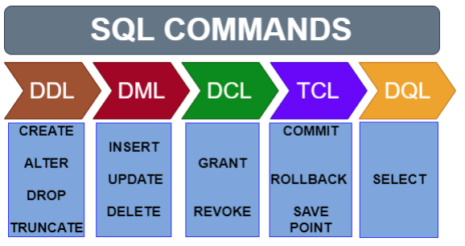

# Lenguaje estructurado de consulta (SQL)

El lenguaje SQL, o lenguaje de consulta estructurado, es hoy el más utilizado en cualquier ámbito en el que se trabaje con bases de datos. Se trata de un lenguaje que permite acceder, modificar o eliminar la información que se almacena en las bases de datos. Esta información está relacionada entre sí, por lo que debe ser estructurada y almacenada siguiendo un sistema. El lenguaje SQL permite interactuar con esa información.

En la década de los 70, en pleno desarrollo de las bases de datos, IBM creaba un lenguaje con el que gestionar los datos almacenados en el nuevo software System R. Era el SEQUEL, que más tarde pasaría a llamarse SQL (Structured Query Language). En 1986, fue declarado estándar del Instituto Nacional Estadounidense de Estándares (ANSI) y, un año después, de la Organización Internacional de Normalización (ISO). Fue tal su impacto, que a partir de ese momento, varias compañías lanzaron su propia versión. Hoy continúa siendo el principal referente. 

Hoy, todas las empresas manejan una cantidad importante de información, pero la clave está en saber gestionarla. En ese sentido, un experto en SQL en el equipo de trabajo es una garantía, ya sea en el sector de las telecomunicaciones como en la industria de la automoción, la hostelería, la educación, la banca, el marketing... Todos ellos son sectores muy distintos, pero con una misma necesidad: el manejo de las bases de datos. Una base de datos correctamente estructurada es una herramienta enormemente útil con un rendimiento muy alto.

Entonces, ¿quién debe aprender SQL? cualquier persona que trabaje con análisis de datos o tratamiento de información debería tener conocimientos de SQL. La ventaja está en que no es difícil de aprender. SQL permite manejar la información contenida en una base de datos sobre todo su utilidad radica en que facilita la búsqueda y la edición de esos datos. Es una alternativa mucho más eficaz que la manual a la hora de organizar información, algo que hacemos constantemente. 

## Comandos SQL

Los comandos del SQL pueden dividirse en:

- **Comandos de definición de datos (DDL - Data Definition Language):** permiten crear y definir nuevas bases de datos, campos, etc.

    - CREATE: se utiliza para crear objetos como bases de datos, tablas, vistas, índices, triggers y procedimientos almacenados.
    - DROP: se utiliza para eliminar los objetos de la base de datos.
    - ALTER: se utiliza para modificar los objetos de la base de datos.
    - SHOW: se utiliza para consultar los objetos de la base de datos.
    - USE: se utiliza para indicar la base de datos con la que queremos trabajar.

- **Comandos de manipulación de datos (DML - Data Manipulation Language):** permite generar consultas para ordenar, filtrar y extraer datos de la base de datos.

- **Comandos de control y seguridad de datos:** gobiernan los privilegios de los usuarios, los controles de acceso.



### Creación de base de datos

`CREATE DATABASE nombre_baseDatos;`

<!--## Estructura básica de las consultas SQL
La estructura básica de una expresión SQL consta de tres cláusulas: select, from y where. Las consultas habituales de SQL tienen la forma: 

```
SELECT a1, a2, ..., an
FROM r1, r2, ..., rm
WHERE p
```-->

