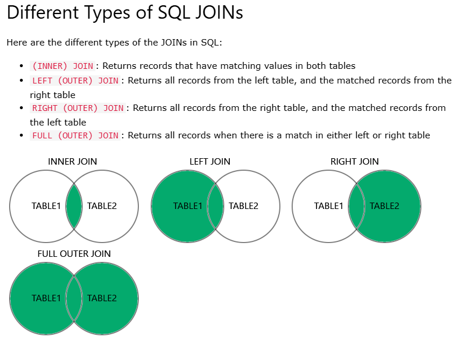

# Consultas SQL

Cuando se requiera seleccionar datos específicos de uno o varios orígenes, se utiliza una consulta de selección. Una consulta de selección ayuda a recuperar únicamente los datos que le interesen y a combinar datos de varios orígenes.

## Consulta Multi tabla
Las consultas multi tabla nos permiten consultar información en más de una tabla. La única diferencia respecto a las consultas sencillas es que vamos a tener que especificar en la cláusula FROM cuáles son las tablas que vamos a usar y cómo las vamos a relacionar entre sí.

### Composiciones cruzadas (Producto cartesiano)
El producto cartesiano de dos conjuntos, es una operación que consiste en obtener otro conjunto cuyos elementos son todas las parejas que pueden formarse entre los dos conjuntos. Por ejemplo, tendríamos que coger el primer elemento del primer conjunto y formar una pareja con cada uno de los elementos del segundo conjunto. Una vez hecho esto, repetimos el mismo proceso para cada uno de los elementos del primer conjunto.

`SELECT * FROM tabla1, tabla2`

### Composiciones internas (Intersección)
La intersección de dos conjuntos es una operación que resulta en otro conjunto que contiene sólo los elementos comunes que existen en ambos conjuntos.

```
SELECT *
FROM tabla1, tabla2
WHERE condicion;
```

### JOIN



- **LEFT JOIN:**

```
SELECT *
FROM tabla1
LEFT JOIN tabla2 ON tabla1.nombreColumna = tabla2.nombreColumna;
``` 

- **RIGHT JOIN:**

```
SELECT *
FROM tabla1
RIGHT JOIN tabla2 ON tabla1.nombreColumna = tabla2.nombreColumna;
```

- **INNER JOIN:**

```
SELECT *
FROM tabla1
INNER JOIN tabla2 ON tabla1.nombreColumna = tabla2.nombreColumna;
```

- **FULL OUTER JOIN:**

```
SELECT *
FROM tabla1
LEFT JOIN tabla2 ON tabla1.nombreColumna = tabla2.nombreColumna;
UNION
SELECT *
FROM tabla1
RIGHT JOIN tabla2 ON tabla1.nombreColumna = tabla2.nombreColumna;
```