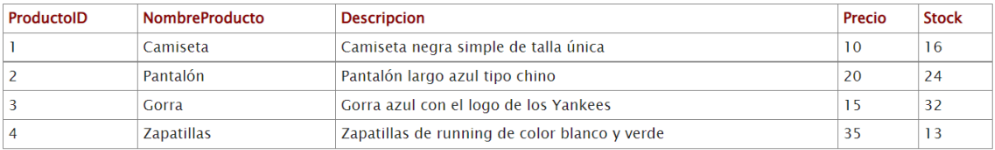

# Funciones

El lenguaje SQL tiene funciones incorporadas para hacer cálculos sobre los datos. 



- **AVG():** devuelve la media de valores de una columna numérica.
`SELECT AVG (atributo) FROM tabla`

- **COUNT():** devuelve el número número de filas que cumplen con un determinado criterio. 

`SELECT COUNT(*) FROM tabla;`

- **MAX():** devuelve el mayor valor de la columna seleccionada.

`SELECT MAX(atributo) FROM tabla;`

- **MIN():** devuelve el menor valor de la columna seleccionada.

`SELECT MIN(atributo) FROM tabla;`

- **MIN():** devuelve el menor valor de la columna seleccionada.

`SELECT MIN(atributo) FROM tabla;`

- **SUM():** devuelve la suma de una columna numérica.

`SELECT SUM(atributo) FROM tabla;`

- **GROUP BY()**

```
SELECT atributo, funcionExtra
FROM tabla
GROUP BY nombreColumna;
```