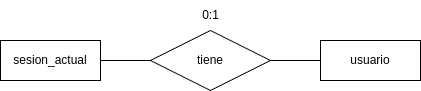
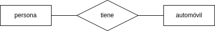
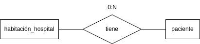
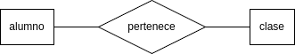

# Modelo y diagrama entidad-relación (conceptual)

## Modelo entidad-relación

El **modelo entidad-relación** es el modelo conceptual más utilizado en el diseño de bases de datos. Fue introducido por Peter Chan en 1976. El modelo entidad-relación está formado por un conjunto de conceptos que permiten describir la realidad mediante un conjunto de representaciones gráficas y lingüísticas. 

- **Entidad:** cualquier tipo de objeto o concepto sobre el que se recoge información: cosa, persona, concepto abstracto o suceso.
Un nombre de entidad sólo puede aparecer una vez en el esquema conceptual. Hay dos tipos de entidades: fuertes y débiles. Una *entidad débil* es una entidad cuya existencia depende de la existencia de otra entidad. Una *entidad fuerte* es una entidad que no es débil.
    - **Atributo:** es el valor que se asigna en la base de datos.

- **Relación:** forma en que se ligan las entidades, se expresan con verbos.

## Diagrama entidad-relación

Los diagramas entidad relación son sencillos y claros, cualidades que pueden ser responsables en gran parte de la popularidad del modelo, estos diagramas constan de los siguientes componentes principales:
- Rectángulos, que representan entidades.
- Elipses, que representan atributos.
- Rombos, que representan relaciones.
- Líneas, que unen los atributos con las entidades y las entidades con las relaciones.
- Elipses dobles, que representan atributos multivaluados.
- Elipses discontinuas, que denotan atributos derivados.
- Rectángulos dobles que representan entidades débiles.
- Identificador único, se deberá de subrayar.
- Cardinalidad

### Tipos de cardinalidad

- *1 a 1:* 

- *0 a 1 (1 a 1 opcional):*

- *1 a N:*

- *0 a N (1 a N opcional):*

- *N a N:*

<!-- ### Normalización

- **1FN: Atributos atómicos (sin repetir campos)**
- **2FN: Cada campo de la tabla debe depender de una clave única**
- **3FN: Los campos que no son clave no deben de tener dependencias**
- **4FN: Los campos multivaluados se identifican por clave única** -->
